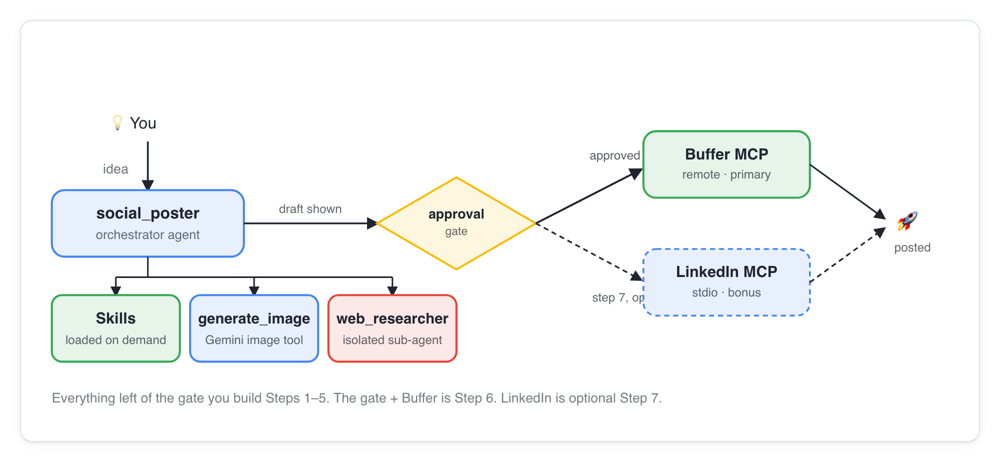

# Social Spark

An AI agent that turns an idea into a finished social post. It researches the web, drafts in your brand voice, generates an image, **waits for your approval**, and then publishes through Buffer or LinkedIn. It is the running project for the GDG London **Agentic DevCamp**: you build it in Lab 1.

> **Start here:** [Setup guide](docs/setup-guide.html) (do this before Saturday) → [Lab 1: Build](docs/lab-1-build.html). All docs are listed in [docs/index.html](docs/index.html).
>
> This repo is the finished reference, not step 1. In Lab 1 you build a smaller version of it yourself. Use this repo when you get stuck or want to see where the labs end up.

## How it works



You give the **orchestrator** (`social_poster`) an idea. It loads **Agent Skills** for your brand voice, calls a **research sub-agent** for facts and an **image tool** for a picture, then shows you the draft. Nothing is published until you press approve. The approval gate is enforced by the framework, not by a polite instruction the model could ignore.

## Tech stack

| Layer | What we use | Why |
|---|---|---|
| Agent framework | [Google ADK](https://google.github.io/adk-docs/) (Python) | Agents, tools, sub-agents, sessions, evals |
| Models | Gemini (`gemini-flash-latest`, Gemini image model) | Reasoning, drafting, image generation |
| Agent knowledge | Agent Skills (`skills/`) | Brand voice as a reviewable markdown folder |
| Publishing | MCP servers: Buffer (remote), LinkedIn (optional, stdio) | Real posts behind a human approval gate |
| Agent-to-agent | A2A (`memory_agent`, optional) | A separate memory service the orchestrator can ask |
| Backend | FastAPI + [`ag-ui-adk`](https://github.com/ag-ui-protocol/ag-ui) | Serves the agent to the UI over AG-UI at `/api/adk` |
| Frontend | Next.js 16, React 19, [CopilotKit](https://copilotkit.ai) | Chat, draft preview and the approve button |
| Data | SQLite (local), Cloud Storage (optional images) | Post history and hosted images |
| Tooling | `uv`, `agents-cli`, `adk eval`, `gcloud` | Install, deploy, quality gate |

## What you build, lab by lab

| Session | Lab | You add | Tag to check out if you fall behind |
|---|---|---|---|
| Setup | [Setup guide](docs/setup-guide.html) | Google Cloud project, tools, coding agent | `starter` |
| 1. Build | [Lab 1](docs/lab-1-build.html) | The agent, skills, tools, approval gate, web UI | `pillar-build` |

```bash
git checkout pillar-build   # for example: the finished result of Lab 1
```


## Run it locally

You need [uv](https://docs.astral.sh/uv/), Node.js 20+, and a Google Cloud project (see the [setup guide](docs/setup-guide.html)). From the repo root:

```bash
cp .env.example backend/social_poster/.env   # set GOOGLE_CLOUD_PROJECT
uv sync
./run-backend.sh                             # terminal 1: http://localhost:8000
./run-frontend.sh                            # terminal 2: http://localhost:3000
```

Publishing is a dry run (`DRY_RUN=true`) until you switch it off, so nothing goes to a real account by accident. More detail: [backend/README.md](backend/README.md) and [frontend/README.md](frontend/README.md).

## What's where

```
backend/social_poster/   the agents, tools and guardrails (agent.py is the place to start)
backend/main.py          FastAPI app: AG-UI route, sessions and memory when deployed
skills/                  Agent Skills (brand voice)
frontend/                Next.js + CopilotKit UI
evals/                   adk eval sets (quality and governance)
docs/                    labs, setup guide, deploy and reference docs
gcp-setup.sh             one-time Google Cloud setup: APIs, templates, grants
```

## Reference docs

| Doc | Covers |
|---|---|
| [LEARNINGS.md](docs/LEARNINGS.md) | What broke and why, by pillar |
